## 义码当仙之设计模式

[推荐设计模式学习站点](http://c.biancheng.net/view/1317.html)

### 概念
是一套被反复使用、多数人知晓、经过分类编目的优秀代码设计经验的总结。使用设计模式是为了重用代码，使代码更易理解并保证代码的可靠性。  

#### 二、分类

> 创建型（5）

创建型模式是用来创建对象的模式，抽象了实例化的过程，帮助一个系统独立于其关联对象的创建、组合和表示方式。

- 单例模式（Singleton Pattern）：
一个类只有一个实例，而且自行实例化并向整个系统提供这个实例。

（1）饿汉式单例类：类加载时，就进行对象实例化；

```
public class HungrySingleton {

    private static HungrySingleton instance = new HungrySingleton();

    // 构造方法私有，保证外界无法直接实例化
    private HungrySingleton(){}

    // 通过该方法获得实例对象
    public static HungrySingleton getInstance(){
        return instance;
    }

}
```
（2）懒汉式单例类：第一次引用类时，才进行对象实例化。


```
public class LazySingleton {

    private LazySingleton instance = null;

    // 构造方法私有，保证外界无法直接实例化
    private LazySingleton(){}

    // 方法同步
    public synchronized LazySingleton getInstance(){
        if(instance == null){
            instance = new LazySingleton();
        }
        return instance;
    }

}
```

- 工厂方法模式（Factory Method Pattern）：
  在工厂方法模式中，工厂类成为了抽象类，实际的创建工作将由其具体子类来完成。工厂方法的用意是定义一个创建产品对象的工厂接口，将实际创建工作推迟到子类中去，强调的是“单个对象”的变化。


- 抽象工厂模式（Abstract Factory Pattern）：
  抽象工厂是所有工厂模式中最为抽象和最具有一般性的一种形态。抽象工厂可以向客户提供一个接口，使得客户可以在不必指定产品具体类型的情况下，创建多个产品族中的产品对象，强调的是“系列对象”的变化。

- 建造者模式（Builder Pattern）：
  把构造对象实例的逻辑转移到了类的内部，在类的外部定义了该类的构造逻辑。它把一个复杂的构造过程从对象的表示中分离出来，其直接效果是将一个复杂的对象简化为一个比较简单的目标对象，强调的是产品的构造过程。

- 原型模式（Prototype Pattern）：
  原型模式和工厂模式一样，同样对客户隐藏了对象创建工作，但通过对一个类进行实例化来构造新对象不同的是，原型模式是通过复制一个现有对象生成新对象。

> 结构型（7）

顾名思义，构造型模式讨论的是类和对象的结构，它采用继承机制来组合接口或实现（类结构型模式），或者通过组合一些对象实现新的功能（对象结构型模式）。这些结构型模式在某些方面具有很大的相似性，但侧重点却各有不同。  

- 代理模式（Proxy Pattern）：
  为其他对象提供一种代理以控制对该对象的访问。

- 装饰模式（Decorator Pattern）：
  动态地给一个对象添加一些额外的职责，就增加功能来说，装饰模式比生成子类更加灵活。

- 适配器模式（Adapter Pattern）：
  将一个类的接口变换成客户端所期待的另一个接口，从而使原本因接口不匹配而无法在一起工作的两个类能够在一起工作。

- 组合模式（Composite Pattern）：
  也叫合成模式，将对象组合成树形结构以表示“部分-整体”的层次结构，使得用户对单个对象和组合对象的使用具有一致性。

- 桥梁模式（Bridge Pattern）：
  也叫桥接模式，将抽象和实现解耦，使得两者可以独立变化。  

- 外观模式（Facade Pattern）：
  也叫门面模式，要求一个子系统的外部与其内部的通信必须通过一个统一的对象进行，外观模式提供一个高层次的接口，使得子系统更易于使用。

- 享元模式（Flyweight Pattern）：
  是池技术的重要实现方式，使用共享对象可有效地支持大量的细粒度的对象。

> 行为型（11）

行为型设计模式关注的是对象的行为，用来解决对象之间的联系问题。

- 模板方法模式（Template Method Pattern）：
  定义一个操作中的算法框架，而将一些步骤延迟到子类中，使得子类可以不改变一个算法的结构即可重定义该算法的某些特定步骤。

- 命令模式（Command Pattern）：
  是一种高内聚的模式，将一个请求封装成一个对象，从而使用不同的请求把客户端参数化，对请求排队或者记录请求日志，可以提供命令的撤销和恢复功能。

- 责任链模式（Chain of Responsibility Pattern）：
  使多个对象都有机会处理请求，从而避免了请求的发送者和接受者之间的耦合关系。将这些对象连成一条链，并沿着这条链传递该请求，直到有对象处理它为止。

- 策略模式（Strategy Pattern）：
  也叫政策模式，定义一组算法，将每个算法都封装起来，并且使它们之间可以互换。

- 迭代器模式（Iterator Pattern）：
  提供一种方法访问一个容器对象中的各个元素，而又不需要暴露该对象的内部细节。

- 中介者模式（Mediator Pattern）：
  用一个中介对象封装一系列的对象交互，中介者使各对象不需要显示地相互作用，从而使其耦合松散，而且可以独立地改变它们之间的交互。

- 观察者模式（Observer Pattern）：
  也叫发布订阅模式，定义对象间的一种一对多的依赖关系，使得每当一个对象改变状态，则所有依赖于它的对象都会得到通知并被自动更新。

- 备忘录模式（Memento Pattern）：
  在不破坏封装性的前提下，捕获一个对象的内部状态，并在该对象之外保存这个状态。

- 访问者模式（Visitor Pattern）：
  封装一些作用于某种数据结构中的各元素的操作，它可以在不改变数据结构的前提下定义作用于这些元素的新操作。

- 状态模式（State Pattern）：
  当一个对象内在状态改变时允许其改变行为，这个对象看起来像改变了其类型，状态模式的核心是封装，状态的改变引起行为的改变。

- 解释器模式（Interpreter Pattern）：
  给定一门语言，定义它的文法的一种表示，并定义一个解释器，该解释器使用该文法表示来解释语言中的句子。

### 设计原则

> 单一职责原则（Single Responsibility Principle，简称SRP）

- 一个类，只有一个引起它变化的原因，应该只有一个职责。
- 提出一个编写程序的标准，用“职责”或“变化原因”来衡量接口或类设计是否优良，但“职责”或“变化原因”都是不可度量的，因项目而异，因环境而异。

> 里氏替换原则（Liskov Substitution Principle，简称LSP）

- 所有引用基类的地方必须能透明地使用其子类对象，反之则不行。
- 在类中调用其他类时务必要使用父类或接口，如果不能使用父类或接口，则说明类的设计已经违背了LSP原则。
- 如果子类不能完整地实现父类的方法，或者父类的某些方法在子类中发生“畸变”，则建议断开父子继承关系，采用依赖、聚集、组合等关系替代继承。
- 策略模式、组合模式、代理模式

> 依赖倒置原则（Dependence Inversion Principle，简称DIP）

- 高层模块不应该依赖低层模块，两者都应依赖其抽象，抽象不依赖细节，而细节依赖抽象。
- 在Java中的表现是：模块间的依赖通过抽象产生，实现类之间不发生直接的依赖关系，其依赖关系是通过接口或抽象类产生，接口或抽象类不依赖于实现类，实现类依赖接口或抽象类。

> 接口隔离原则（Interface Segregation Principle，简称ISP）

- 一个类对另外一个类的依赖性应当是建立在最小的接口上，使用多个专门的接口比使用单一的总接口要好。

> 迪米特法则（Law of Demeter，简称LoD）

- 一个对象应该对其他对象有最少的了解，即一个类应该对自己需要耦合或者调用的类知道得最少。
- 外观模式、中介者模式

> 开闭原则（Open-Closed Principle，简称OCP）

- 一个软件实体，如类、模块和函数应该对外扩展开放，对修改关闭。

> 组合/聚合复用原则（Composite/Aggregate Reuse Principle，简称CRP）
- 组合/聚合复用原则就是在一个新的对象里面使用一些已有的对象，使之成为新对象的一部分; 新的对象通过向这些对象的委派达到复用已有功能的目的。   
- 在面向对象的设计中，如果直接继承基类，会破坏封装，因为继承将基类的实现细节暴露给子类；如果基类的实现发生了改变，则子类的实现也不得不改变；
从基类继承而来的实现是静态的，不可能在运行时发生改变，没有足够的灵活性。于是就提出了组合/聚合复用原则，也就是在实际开发设计中，尽量使用组合/聚合，不要使用类继承。

### 分类

> 创建型（5）

创建型模式是用来创建对象的模式，抽象了实例化的过程，帮助一个系统独立于其关联对象的创建、组合和表示方式。

- 单例模式（Singleton Pattern）：
一个类只有一个实例，而且自行实例化并向整个系统提供这个实例。

- 工厂方法模式（Factory Method Pattern）：
  在工厂方法模式中，工厂类成为了抽象类，实际的创建工作将由其具体子类来完成。工厂方法的用意是定义一个创建产品对象的工厂接口，将实际创建工作推迟到子类中去，强调的是“单个对象”的变化。

- 抽象工厂模式（Abstract Factory Pattern）：
  抽象工厂是所有工厂模式中最为抽象和最具有一般性的一种形态。抽象工厂可以向客户提供一个接口，使得客户可以在不必指定产品具体类型的情况下，创建多个产品族中的产品对象，强调的是“系列对象”的变化。

- 建造者模式（Builder Pattern）：
  把构造对象实例的逻辑转移到了类的内部，在类的外部定义了该类的构造逻辑。它把一个复杂的构造过程从对象的表示中分离出来，其直接效果是将一个复杂的对象简化为一个比较简单的目标对象，强调的是产品的构造过程。

- 原型模式（Prototype Pattern）：
  原型模式和工厂模式一样，同样对客户隐藏了对象创建工作，但通过对一个类进行实例化来构造新对象不同的是，原型模式是通过复制一个现有对象生成新对象。

> 结构型（7）

顾名思义，构造型模式讨论的是类和对象的结构，它采用继承机制来组合接口或实现（类结构型模式），或者通过组合一些对象实现新的功能（对象结构型模式）。这些结构型模式在某些方面具有很大的相似性，但侧重点却各有不同。  

- 代理模式（Proxy Pattern）：
  为其他对象提供一种代理以控制对该对象的访问。

- 装饰模式（Decorator Pattern）：
  动态地给一个对象添加一些额外的职责，就增加功能来说，装饰模式比生成子类更加灵活。

- 适配器模式（Adapter Pattern）：
  将一个类的接口变换成客户端所期待的另一个接口，从而使原本因接口不匹配而无法在一起工作的两个类能够在一起工作。

- 组合模式（Composite Pattern）：
  也叫合成模式，将对象组合成树形结构以表示“部分-整体”的层次结构，使得用户对单个对象和组合对象的使用具有一致性。

- 桥梁模式（Bridge Pattern）：
  也叫桥接模式，将抽象和实现解耦，使得两者可以独立变化。  

- 外观模式（Facade Pattern）：
  也叫门面模式，要求一个子系统的外部与其内部的通信必须通过一个统一的对象进行，外观模式提供一个高层次的接口，使得子系统更易于使用。

- 享元模式（Flyweight Pattern）：
  是池技术的重要实现方式，使用共享对象可有效地支持大量的细粒度的对象。

> 行为型（11）

行为型设计模式关注的是对象的行为，用来解决对象之间的联系问题。

- 模板方法模式（Template Method Pattern）：
  定义一个操作中的算法框架，而将一些步骤延迟到子类中，使得子类可以不改变一个算法的结构即可重定义该算法的某些特定步骤。

- 命令模式（Command Pattern）：
  是一种高内聚的模式，将一个请求封装成一个对象，从而使用不同的请求把客户端参数化，对请求排队或者记录请求日志，可以提供命令的撤销和恢复功能。

- 责任链模式（Chain of Responsibility Pattern）：
  使多个对象都有机会处理请求，从而避免了请求的发送者和接受者之间的耦合关系。将这些对象连成一条链，并沿着这条链传递该请求，直到有对象处理它为止。

- 策略模式（Strategy Pattern）：
  也叫政策模式，定义一组算法，将每个算法都封装起来，并且使它们之间可以互换。

- 迭代器模式（Iterator Pattern）：
  提供一种方法访问一个容器对象中的各个元素，而又不需要暴露该对象的内部细节。

- 中介者模式（Mediator Pattern）：
  用一个中介对象封装一系列的对象交互，中介者使各对象不需要显示地相互作用，从而使其耦合松散，而且可以独立地改变它们之间的交互。

- 观察者模式（Observer Pattern）：
  也叫发布订阅模式，定义对象间的一种一对多的依赖关系，使得每当一个对象改变状态，则所有依赖于它的对象都会得到通知并被自动更新。

- 备忘录模式（Memento Pattern）：
  在不破坏封装性的前提下，捕获一个对象的内部状态，并在该对象之外保存这个状态。

- 访问者模式（Visitor Pattern）：
  封装一些作用于某种数据结构中的各元素的操作，它可以在不改变数据结构的前提下定义作用于这些元素的新操作。

- 状态模式（State Pattern）：
  当一个对象内在状态改变时允许其改变行为，这个对象看起来像改变了其类型，状态模式的核心是封装，状态的改变引起行为的改变。

- 解释器模式（Interpreter Pattern）：
  给定一门语言，定义它的文法的一种表示，并定义一个解释器，该解释器使用该文法表示来解释语言中的句子。  

<hr>

### 单例模式  
保证一个类只有一个实例，并且提供一个访问该全局访问点。  

> 示例代码：ymdx-design-patterns -> dp01-creation -> singleton

#### 应用场景
1. Windows的Task Manager（任务管理器）就是很典型的单例模式（这个很熟悉吧），想想看，是不是呢，你能打开两个windows task manager吗？不信你自己试试看哦～   
2. Windows的Recycle Bin（回收站）也是典型的单例应用。在整个系统运行过程中，回收站一直维护着仅有的一个实例。  
3. 网站的计数器，一般也是采用单例模式实现，否则难以同步。  
4. 应用程序的日志应用，一般都采用单例模式实现，这一般是由于共享的日志文件一直处于打开状态，因为只能有一个实例去操作，否则内容不好追加。  
5. Web应用的配置对象的读取，一般也应用单例模式，这个是由于配置文件是共享的资源。  
6. 数据库连接池的设计一般也是采用单例模式，因为数据库连接是一种数据库资源。数据库软件系统中使用数据库连接池，主要是节省打开或者关闭数据库连接所引起的效率损耗，这种效率上的损耗还是非常昂贵的，因为何用单例模式来维护，就可以大大降低这种损耗。  
7. 多线程的线程池的设计一般也是采用单例模式，这是由于线程池要方便对池中的线程进行控制。  
8. 操作系统的文件系统，也是大的单例模式实现的具体例子，一个操作系统只能有一个文件系统。  
9. HttpApplication 也是单位例的典型应用。熟悉ASP.Net（IIS）的整个请求生命周期的人应该知道HttpApplication也是单例模式，所有的HttpModule都共享一个HttpApplication实例。
10. Servlet、Spring（默认单例）、Struts2、数据库连接池、线程池、枚举、常量... 

#### 单例优缺点
优点：   
1. 在单例模式中，活动的单例只有一个实例，对单例类的所有实例化得到的都是相同的一个实例。这样就防止其它对象对自己的实例化，确保所有的对象都访问一个实例。  
2. 单例模式具有一定的伸缩性，类自己来控制实例化进程，类就在改变实例化进程上有相应的伸缩性。  
3. 提供了对唯一实例的受控访问。  
4. 由于在系统内存中只存在一个对象，因此可以 节约系统资源，当需要频繁创建和销毁的对象时单例模式无疑可以提高系统的性能。  
5. 允许可变数目的实例。  
6. 避免对共享资源的多重占用。  

缺点：
1. 不适用于变化的对象，如果同一类型的对象总是要在不同的用例场景发生变化，单例就会引起数据的错误，不能保存彼此的状态。   
2. 由于单利模式中没有抽象层，因此单例类的扩展有很大的困难。   
3. 单例类的职责过重，在一定程度上违背了“单一职责原则”。   
4. 滥用单例将带来一些负面问题，如为了节省资源将数据库连接池对象设计为的单例类，可能会导致共享连接池对象的程序过多而出现连接池溢出；如果实例化的对象长时间不被利用，系统会认为是垃圾而被回收，这将导致对象状态的丢失。  

#### 单例创建方式
1. 饿汉式：类初始化时，会立即加载该对象，线程天生安全，调用效率高。  
2. 懒汉式：类初始化时，不会初始化该对象,真正需要使用的时候才会创建该对象，具备懒加载功能。    
3. 静态内部类方式：结合了懒汉式和饿汉式各自的优点，真正需要对象的时候才会加载，加载类是线程安全的。  
4. 枚举单例：使用枚举实现单例模式。优点：实现简单、调用效率高，枚举本身就是单例，由jvm从根本上提供保障！避免通过反射和反序列化的漏洞，缺点没有延迟加载。  
5. 双重检验锁方式：因为JVM本质重排序的原因，可能会初始化多次，不推荐使用   

#### 单例防止反射漏洞攻击
在构造函数中，只能允许初始化一次即可。  
```java
private static boolean flag = false;

private Singleton() {
    if (!flag) {
        flag = true;
    } else {
        throw new RuntimeException("单例模式被侵犯！");
    }
}
```

#### 如何选择单例创建方式
1. 如果不需要延迟加载，可以使用枚举或者饿汉式，相对来说枚举式好于饿汉式。  
2. 如果需要延迟加载，可以使用静态内部类式或者懒汉式，相对来说静态内部类式好于懒汉式。 

<hr>

### 厂方（Factory）模式
实现了创建者和调用者分离，工厂模式分为简单工厂、工厂方法、抽象工厂模式。  

#### 工厂模式好处
工厂模式是我们最常用的实例化对象模式，是用工厂方法代替new操作的一种模式。  
利用工厂模式可以降低程序的耦合性，为后期的维护修改提供了很大的便利。  
将选择实现类、创建对象统一管理和控制。从而将调用者跟我们的实现类解耦。  

### 简单工厂（Simple Factory）模式（不是23种设计模式之一）
简单工厂模式相当于是一个工厂中有各种产品，创建在一个类中，客户无需知道具体产品的名称，只需要知道产品类所对应的参数即可。但是工厂的职责过重，而且当类型过多时不利于系统的扩展维护。  

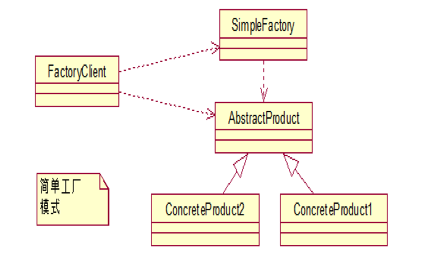  

> 示例代码：ymdx-design-patterns -> dp01-creation -> simple_factory

#### 单工厂的优点/缺点
优点：简单工厂模式能够根据外界给定的信息，决定究竟应该创建哪个具体类的对象。明确区分了各自的职责和权力，有利于整个软件体系结构的优化。  
缺点：很明显工厂类集中了所有实例的创建逻辑，容易违反GRASP（职责分配原则）。违背高内聚  

### 工厂方法（Factory Method）模式
工厂方法模式Factory Method，又称多态性工厂模式。在工厂方法模式中，核心的工厂类不再负责所有的产品的创建，而是将具体创建的工作交给子类去做。  
该核心类成为一个抽象工厂角色，仅负责给出具体工厂子类必须实现的接口，而不接触哪一个产品类应当被实例化这种细节。  

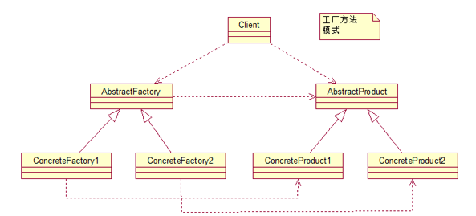  

> 示例代码：ymdx-design-patterns -> dp01-creation -> factory_method

### 抽象工厂（Abstract Factory）模式
抽象工厂简单地说是工厂的工厂，抽象工厂可以创建具体工厂，由具体工厂来产生具体产品。  

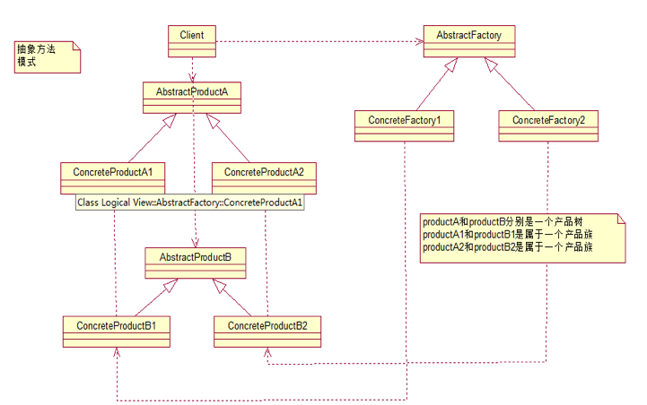  

> 示例代码：ymdx-design-patterns -> dp01-creation -> abstract_factory

#### 简单工厂、工厂方法、抽象工厂之小结、区别
简单工厂：用来生产同一等级结构中的任意产品。（不支持拓展增加产品）  
工厂方法：用来生产同一等级结构中的固定产品。（支持拓展增加产品）  
抽象工厂：用来生产不同产品族的全部产品。（不支持拓展增加产品；支持增加产品族）  

<hr>

### 代理（Proxy）模式
代理模式的定义：由于某些原因需要给某对象提供一个代理以控制对该对象的访问。这时，访问对象不适合或者不能直接引用目标对象，代理对象作为访问对象和目标对象之间的中介。  

> 示例代码：ymdx-design-patterns -> dp02-structure -> proxy   

#### 代理模式的优缺点
- 优点  
1. 代理模式在客户端与目标对象之间起到一个中介作用和保护目标对象的作用；  
2. 代理对象可以扩展目标对象的功能；  
3. 代理模式能将客户端与目标对象分离，在一定程度上降低了系统的耦合度；  

- 缺点：  
1. 在客户端和目标对象之间增加一个代理对象，会造成请求处理速度变慢；  
2. 增加了系统的复杂度；  

#### 代理模式的结构
代理模式的主要角色如下：  
1. 抽象主题（Subject）类：通过接口或抽象类声明真实主题和代理对象实现的业务方法。  
2. 真实主题（Real Subject）类：实现了抽象主题中的具体业务，是代理对象所代表的真实对象，是最终要引用的对象。  
3. 代理（Proxy）类：提供了与真实主题相同的接口，其内部含有对真实主题的引用，它可以访问、控制或扩展真实主题的功能。  

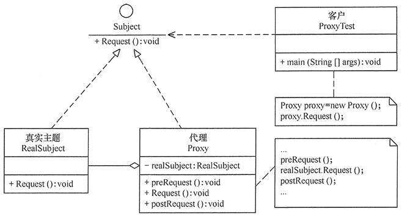  

#### 代理模式应用场景
SpringAOP、事务原理、日志打印、权限控制、远程调用、安全代理，可以隐蔽真实角色

#### 代理的分类
1. 静态代理（静态定义代理类）  
2. 动态代理（动态生成代理类）  
3. Jdk自带动态代理    
4. Cglib 、javaassist（字节码操作库）  

#### 静态代理  
由程序员创建或工具生成代理类的源码，再编译代理类。所谓静态也就是在程序运行前就已经存在代理类的字节码文件，代理类和委托类的关系在运行前就确定了。  

#### 动态代理
1. 代理对象不需要实现接口  
2. 代理对象的生成是利用JDK的API，动态的在内存中构建代理对象（需要我们指定创建代理对象／目标对象实现的接口的类型）  
3. 动态代理也叫做：JDK代理，接口代理  

#### JDK动态代理
- 原理  
是根据类加载器和接口创建代理类（此代理类是接口的实现类，所以必须使用接口，面向接口生成代理，位于java.lang.reflect包下） 

- 实现方式 
1. 通过实现InvocationHandler接口创建自己的调用处理器   
InvocationHandler handler = new InvocationHandlerImpl(…);   
2. 通过为Proxy类指定ClassLoader对象和一组interface创建动态代理类  
Class clazz = Proxy.getProxyClass(classLoader, new Class[]{…});   
3. 通过反射机制获取动态代理类的构造函数，其参数类型是调用处理器接口类型  
Constructor constructor = clazz.getConstructor(new Class[]{InvocationHandler.class});   
4. 通过构造函数创建代理类实例，此时需将调用处理器对象作为参数被传入  
Interface Proxy = (Interface)constructor.newInstance(new Object[] (handler));  

- 缺点  
jdk动态代理，必须是面向接口，目标业务类必须实现接口  

#### CGLIB动态代理
使用cglib[Code Generation Library]实现动态代理，并不要求委托类必须实现接口，底层采用asm字节码生成框架生成代理类的字节码  
原理：利用asm开源包，将代理对象类的class文件加载进来，通过修改其字节码生成子类来处理。  

#### CGLIB动态代理与JDK动态区别  
java动态代理是利用反射机制生成一个实现代理接口的匿名类，在调用具体方法前调用InvokeHandler来处理。  
而cglib动态代理是利用asm开源包，对代理对象类的class文件加载进来，通过修改其字节码生成子类来处理。  
Spring中，  
1、如果目标对象实现了接口，默认情况下会采用JDK的动态代理实现AOP   
2、如果目标对象实现了接口，可以强制使用CGLIB实现AOP   
3、如果目标对象没有实现了接口，必须采用CGLIB库，spring会自动在JDK动态代理和CGLIB之间转换  

JDK动态代理只能对实现了接口的类生成代理，而不能针对类。  
CGLIB是针对类实现代理，主要是对指定的类生成一个子类，覆盖其中的方法。  
因为是继承，所以该类或方法最好不要声明成final，final可以阻止继承和多态。  

<hr>

### 建造者（Builder）模式
指将一个复杂对象的构造与它的表示分离，使同样的构建过程可以创建不同的表示，这样的设计模式被称为建造者模式。  
它是将一个复杂的对象分解为多个简单的对象，然后一步一步构建而成。它将变与不变相分离，即产品的组成部分是不变的，但每一部分是可以灵活选择的。  

#### 建造者模式的优缺点
- 优点  
1. 各个具体的建造者相互独立，有利于系统的扩展。  
2. 客户端不必知道产品内部组成的细节，便于控制细节风险。  

- 缺点
1. 产品的组成部分必须相同，这限制了其使用范围。  
2. 如果产品的内部变化复杂，该模式会增加很多的建造者类。  

建造者（Builder）模式和工厂模式的关注点不同：建造者模式注重零部件的组装过程，而工厂方法模式更注重零部件的创建过程，但两者可以结合使用。  

#### 建造者模式的结构
建造者模式的主要角色如下：    
1. 产品角色（Product）：它是包含多个组成部件的复杂对象，由具体建造者来创建其各个滅部件。  
2. 抽象建造者（Builder）：它是一个包含创建产品各个子部件的抽象方法的接口，通常还包含一个返回复杂产品的方法 getResult()。  
3. 具体建造者（Concrete Builder）：实现 Builder 接口，完成复杂产品的各个部件的具体创建方法。  
4. 指挥者（Director）：它调用建造者对象中的部件构造与装配方法完成复杂对象的创建，在指挥者中不涉及具体产品的信息。  

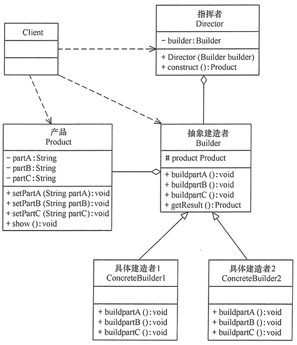  

#### 建造者应用场景
1、去肯德基，汉堡、可乐、薯条、炸鸡翅等是不变的，而其组合是经常变化的，生成出所谓的"套餐"。  
2、JAVA中的StringBuilder。 底层字符数组，将单个字符整合在一起，构成字符串。  
使用场景：  
1、需要生成的对象具有复杂的内部结构。   
2、需要生成的对象内部属性本身相互依赖。  
与工厂模式的区别是：建造者模式更加关注与零件装配的顺序。  

> 示例代码：ymdx-design-patterns -> dp01-creation -> builder

<hr>

### 模板方法（Template Method）模式
定义一个操作中的算法骨架，而将算法的一些步骤延迟到子类中，使得子类可以不改变该算法结构的情况下重定义该算法的某些特定步骤。它是一种类行为型模式。   
（重复代码全部在父类里面，不同业务的，使用抽象方法，抽取给子类进行实现。抽取过程 --> 抽象方法）

核心：处理某个流程的代码已经都具备，但是其中某个节点的代码暂时不能确定。因此，我们采用模板方法模式，将这个节点的代码实现转移给子类完成。  
即，处理步骤在父类中定义好，具体的实现延迟到子类中定义。说白了，就是将一些相同操作的代码，封装成一个算法的骨架。核心的部分留在子类中操作，在父类中只把那些骨架做好。  

例如：  
1. 去银行办业务，银行给我们提供了一个模板就是：先取号，排队，办理业务（核心部分由子类完成），给客服人员评分，完毕。  
这里办理业务是属于子类来完成的，其他的取号，排队，评分则是一个模板。  
2. 去餐厅吃饭，餐厅给提供的一套模板就是：先点餐，等待，吃饭（核心部分由子类完成），买单  
这里吃饭是属于子类来完成的，其他的点餐，买单则是餐厅提供给我们客户的一个模板。  

#### 模板方法模式的优缺点
- 优点  
1. 它封装了不变部分，扩展可变部分。它把认为是不变部分的算法封装到父类中实现，而把可变部分算法由子类继承实现，便于子类继续扩展。  
2. 它在父类中提取了公共的部分代码，便于代码复用。  
3. 部分方法是由子类实现的，因此子类可以通过扩展方式增加相应的功能，符合开闭原则。  

- 缺点  
1. 对每个不同的实现都需要定义一个子类，这会导致类的个数增加，系统更加庞大，设计也更加抽象。  
2. 父类中的抽象方法由子类实现，子类执行的结果会影响父类的结果，这导致一种反向的控制结构，它提高了代码阅读的难度。  

#### 模板方法模式的结构  
模板方法模式的主要角色如下：  
1. 抽象类（Abstract Class）：负责给出一个算法的轮廓和骨架。它由一个模板方法和若干个基本方法构成。这些方法的定义如下。  
① 模板方法：定义了算法的骨架，按某种顺序调用其包含的基本方法。  
② 基本方法：是整个算法中的一个步骤，包含以下几种类型。  
抽象方法：在抽象类中申明，由具体子类实现。  
具体方法：在抽象类中已经实现，在具体子类中可以继承或重写它。  
钩子方法：在抽象类中已经实现，包括用于判断的逻辑方法和需要子类重写的空方法两种。  
2. 具体子类（Concrete Class）：实现抽象类中所定义的抽象方法和钩子方法，它们是一个顶级逻辑的一个组成步骤。  

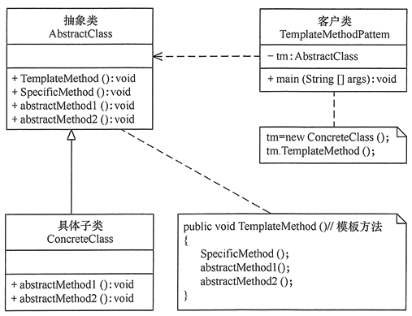  

#### 什么时候使用模板方法
实现一些操作时，整体步骤很固定，但是呢，就是其中一小部分容易变，这时候可以使用模板方法模式，将容易变的部分抽象出来，供子类实现。  

#### 开发中应用场景
其实，各个框架中，都有模板方法模式的影子。  
数据库访问的封装、Junit单元测试、servlet中关于doGet/doPost方法的调用、Hibernate中模板程序、spring中JdbcTemplate，HibernateTemplate等等  

> 示例代码：ymdx-design-patterns -> dp03-behavior -> template_method  

<hr>

### 适配器（Adapter）模式
将一个类的接口转换成客户希望的另外一个接口，使得原本由于接口不兼容而不能一起工作的那些类能一起工作。  
适配器模式分为类结构型模式和对象结构型模式两种，前者类之间的耦合度比后者高，且要求程序员了解现有组件库中的相关组件的内部结构，所以应用相对较少些。  

#### 适配器模式的优缺点
- 优点  
1. 客户端通过适配器可以透明地调用目标接口。  
2. 复用了现存的类，程序员不需要修改原有代码而重用现有的适配者类。  
3. 将目标类和适配者类解耦，解决了目标类和适配者类接口不一致的问题。  

- 缺点  
1. 对类适配器来说，更换适配器的实现过程比较复杂。  

#### 适配器模式的结构  
适配器模式（Adapter）包含以下主要角色：  
1. 目标（Target）接口：当前系统业务所期待的接口，它可以是抽象类或接口。  
2. 适配者（Adaptee）类：它是被访问和适配的现存组件库中的组件接口。  
3. 适配器（Adapter）类：它是一个转换器，通过继承或引用适配者的对象，把适配者接口转换成目标接口，让客户按目标接口的格式访问适配者。    

类适配器模式结构图：  
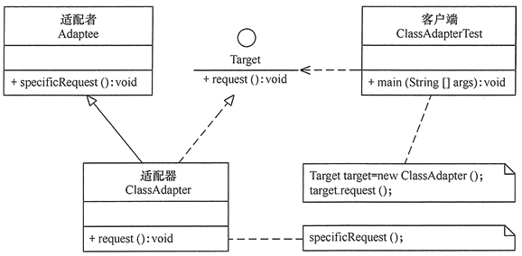  

对象适配器模式结构图：  
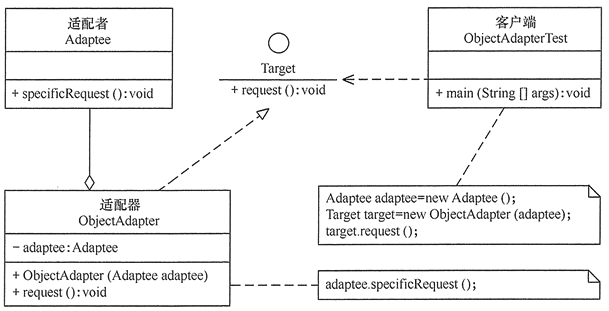  

#### 适配器应用场景
我们根据上面的适配器的特点的介绍中，我们来分析下适配器模式的几类比较适用的使用场景：  
1. 我们在使用第三方的类库，或者说第三方的API的时候，我们通过适配器转换来满足现有系统的使用需求。  
2. 我们的旧系统与新系统进行集成的时候，我们发现旧系统的数据无法满足新系统的需求，那么这个时候，我们可能需要适配器，完成调用需求。  
3. 我们在使用不同数据库之间进行数据同步。（这里分析的是通过程序实现的情况）  

OutputStreamWriter：是Writer的子类，将输出的字符流变为字节流，即：将一个字符流的输出对象变为字节流的输出对象。  
InputStreamReader：是Reader的子类，将输入的字节流变为字符流，即：将一个字节流的输入对象变为字符流的输入对象。  
SpringMVC 适配器  

> 示例代码：ymdx-design-patterns -> dp02-structure -> adaptor    

<hr>

### 外观（Facade）模式
是一种通过为多个复杂的子系统提供一个一致的接口，而使这些子系统更加容易被访问的模式。  
该模式对外有一个统一接口，外部应用程序不用关心内部子系统的具体的细节，这样会大大降低应用程序的复杂度，提高了程序的可维护性。  

#### 外观模式的优缺点  
- 优点   
外观（Facade）模式是“迪米特法则”的典型应用，它有以下主要优点：  
1. 降低了子系统与客户端之间的耦合度，使得子系统的变化不会影响调用它的客户类。   
2. 对客户屏蔽了子系统组件，减少了客户处理的对象数目，并使得子系统使用起来更加容易。  
3. 降低了大型软件系统中的编译依赖性，简化了系统在不同平台之间的移植过程，因为编译一个子系统不会影响其他的子系统，也不会影响外观对象。  

- 缺点  
1. 不能很好地限制客户使用子系统类。  
2. 增加新的子系统可能需要修改外观类或客户端的源代码，违背了“开闭原则”。  

#### 外观模式的结构
外观（Facade）模式包含以下主要角色：  
1. 外观（Facade）角色：为多个子系统对外提供一个共同的接口。  
2. 子系统（Sub System）角色：实现系统的部分功能，客户可以通过外观角色访问它。  
3. 客户（Client）角色：通过一个外观角色访问各个子系统的功能。  

  

<hr>  

### 原型（Prototype）模式
原型模式是一个创建型的模式。原型二字表明了改模式应该有一个样板实例，用户从这个样板对象中复制一个内部属性一致的对象，这个过程也就是我们称的“克隆”。  
被复制的实例就是我们所称的“原型”，这个原型是可定制的。原型模式多用于创建复杂的或者构造耗时的实例，因为这种情况下，复制一个已经存在的实例可使程序运行更高效。  

#### 原型模式的结构  
原型模式包含以下主要角色：  
1. 抽象原型类：规定了具体原型对象必须实现的接口。  
2. 具体原型类：实现抽象原型类的 clone() 方法，它是可被复制的对象。  
3. 访问类：使用具体原型类中的 clone() 方法来复制新的对象。  

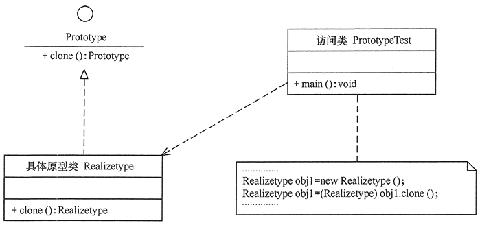  

#### 原型模式应用场景     
1. 类初始化需要消化非常多的资源，这个资源包括数据、硬件资源等，通过原型拷贝避免这些消耗。   
2. 通过new产生的一个对象需要非常繁琐的数据准备或者权限，这时可以使用原型模式。   
3. 一个对象需要提供给其他对象访问，而且各个调用者可能都需要修改其值时，可以考虑使用原型模式拷贝多个对象供调用者使用，即保护性拷贝。  
Spring框架中的多例就是使用原型。  

<hr>

#### 原型模式分类
原型模式分为浅复制和深复制：  
1. 浅复制：只是拷贝了基本类型的数据，而引用类型数据，复制后也是会发生引用，我们把这种拷贝叫做“（浅复制）浅拷贝”，  
换句话说，浅复制仅仅是指向被复制的内存地址，如果原地址中对象被改变了，那么浅复制出来的对象也会相应改变。
2. 深复制：在计算机中开辟了一块新的内存地址用于存放复制的对象。  

<hr>

### 策略（Strategy）模式
该模式定义了一系列算法，并将每个算法封装起来，使它们可以相互替换，且算法的变化不会影响使用算法的客户。  
策略模式属于对象行为模式，它通过对算法进行封装，把使用算法的责任和算法的实现分割开来，并委派给不同的对象对这些算法进行管理。  

#### 策略模式的优缺点  
- 优点  
1. 多重条件语句不易维护，而使用策略模式可以避免使用多重条件语句。  
2. 策略模式提供了一系列的可供重用的算法族，恰当使用继承可以把算法族的公共代码转移到父类里面，从而避免重复的代码。  
3. 策略模式可以提供相同行为的不同实现，客户可以根据不同时间或空间要求选择不同的。  
4. 策略模式提供了对开闭原则的完美支持，可以在不修改原代码的情况下，灵活增加新算法。  
5. 策略模式把算法的使用放到环境类中，而算法的实现移到具体策略类中，实现了二者的分离。  
     
- 缺点  
1. 客户端必须理解所有策略算法的区别，以便适时选择恰当的算法类。  
2. 策略模式造成很多的策略类。  

#### 策略模式的结构
策略模式的主要角色如下：  
1. 抽象策略（Strategy）类：定义了一个公共接口，各种不同的算法以不同的方式实现这个接口，环境角色使用这个接口调用不同的算法，一般使用接口或抽象类实现。  
2. 具体策略（Concrete Strategy）类：实现了抽象策略定义的接口，提供具体的算法实现。  
3. 环境（Context）类：持有一个策略类的引用，最终给客户端调用。  

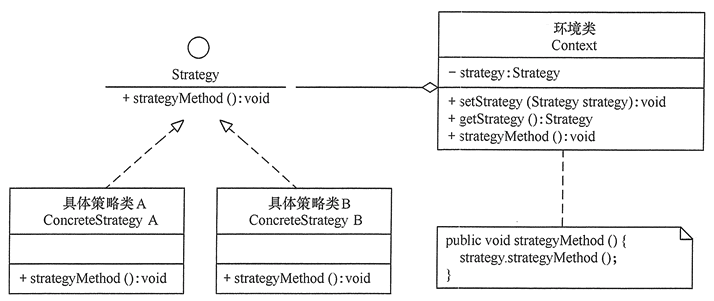  

#### 策略模式应用场景
策略模式的用意是针对一组算法或逻辑，将每一个算法或逻辑封装到具有共同接口的独立的类中，从而使得它们之间可以相互替换。  
策略模式使得算法或逻辑可以在不影响到客户端的情况下发生变化。说到策略模式就不得不提及OCP(Open Closed Principle) 开闭原则，即对扩展开放，对修改关闭。  
策略模式的出现很好地诠释了开闭原则，有效地减少了分支语句。  

<hr>

### 装饰（Decorator）模式
指在不改变现有对象结构的情况下，动态地给该对象增加一些职责（即增加其额外功能）的模式，它属于对象结构型模式。  
    
### 装饰模式优缺点
- 优点  
1. 采用装饰模式扩展对象的功能比采用继承方式更加灵活。  
2. 可以设计出多个不同的具体装饰类，创造出多个不同行为的组合。  
- 缺点  
装饰模式增加了许多子类，如果过度使用会使程序变得很复杂。  

### 装饰模式的结构  
装饰模式主要包含以下角色：  
抽象构件（Component）角色：定义一个抽象接口以规范准备接收附加责任的对象。  
具体构件（Concrete Component）角色：实现抽象构件，通过装饰角色为其添加一些职责。  
抽象装饰（Decorator）角色：继承抽象构件，并包含具体构件的实例，可以通过其子类扩展具体构件的功能。  
具体装饰（ConcreteDecorator）角色：实现抽象装饰的相关方法，并给具体构件对象添加附加的责任。  

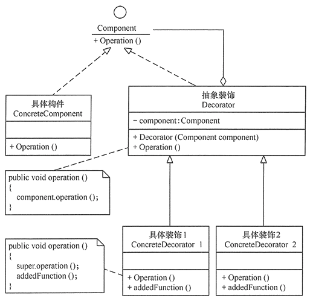  

#### 装饰与代理区别
装饰器模式关注于在一个对象上动态的添加方法，然而代理模式关注于控制对对象的访问。  
换句话说，用代理模式，代理类（proxy class）可以对它的客户隐藏一个对象的具体信息。因此，当使用代理模式的时候，我们常常在一个代理类中创建一个对象的实例。  
但是，当我们使用装饰器模式的时候，我们通常的做法是将原始对象作为一个参数传给装饰者的构造器。  

#### 装饰模式应用场景
在IO中，具体构件角色是节点流，装饰角色是过滤流。  
FilterInputStream和FilterOutputStream是装饰角色，而其他派生自它们的类则是具体装饰角色。  
DataoutputStream out=new DataoutputStream(new FileoutputStream());  
这就是装饰者模式，DataoutputStream是装饰者子类，FileoutputStream是实现接口的子类。  
这里不会调用到装饰者类 FilteroutputStream，只是作为继承的另一种方案，对客户端来说是透明的，是为了功能的扩展。  

<hr>

### 观察者（Observer）模式  
指多个对象间存在一对多的依赖关系，当一个对象的状态发生改变时，所有依赖于它的对象都得到通知并被自动更新。  
这种模式有时又称作发布-订阅模式、模型-视图模式，它是对象行为型模式。  

#### 观察者模式优缺点
- 优点  
1. 降低了目标与观察者之间的耦合关系，两者之间是抽象耦合关系。  
2. 目标与观察者之间建立了一套触发机制。  

- 缺点  
1. 目标与观察者之间的依赖关系并没有完全解除，而且有可能出现循环引用。  
2. 当观察者对象很多时，通知的发布会花费很多时间，影响程序的效率。  

#### 观察者模式的结构
观察者模式的主要角色如下：  
1. 抽象主题（Subject）角色：也叫抽象目标类，它提供了一个用于保存观察者对象的聚集类和增加、删除观察者对象的方法，以及通知所有观察者的抽象方法。  
2. 具体主题（Concrete Subject）角色：也叫具体目标类，它实现抽象目标中的通知方法，当具体主题的内部状态发生改变时，通知所有注册过的观察者对象。  
3. 抽象观察者（Observer）角色：它是一个抽象类或接口，它包含了一个更新自己的抽象方法，当接到具体主题的更改通知时被调用。  
4. 具体观察者（Concrete Observer）角色：实现抽象观察者中定义的抽象方法，以便在得到目标的更改通知时更新自身的状态。  

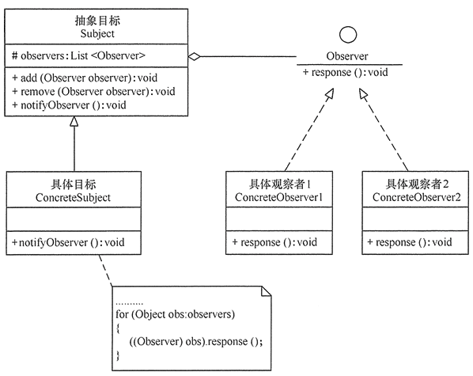  

#### 观察者模式的职责
观察者模式主要用于1对N的通知。当一个对象的状态变化时，他需要及时告知一系列对象，令他们做出响应。    
实现有两种方式：  
- 推：每次都会把通知以广播的方式发送给所有观察者，所有的观察者只能被动接收。   
- 拉：观察者只要知道有情况即可，至于什么时候获取内容，获取什么内容，都可以自主决定。  

#### 观察者模式应用场景
1. 关联行为场景，需要注意的是，关联行为是可拆分的，而不是“组合”关系。  
2. 事件多级触发场景。  
3. 跨系统的消息交换场景，如消息队列、事件总线的处理机制。  

<hr>


  
  


